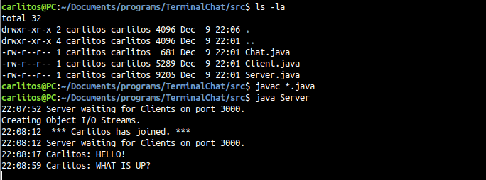
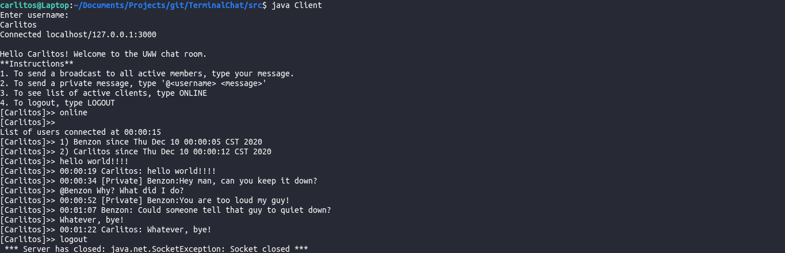

# TerminalChat
> Benzon Carlitos Salazar

## About
Terminal-based chat system that utilizes socket programming.

## How to run
1. Open a terminal, locate the [src](src/) folder, and compile all files
```
$ javac *.java
```
2. Run Server side
```
$ java Server
```
3. Open another terminal, and locate the [src](src/) folder, and run the Client
```
$ java Client
```

## Example
### Server Side

### Client Side

